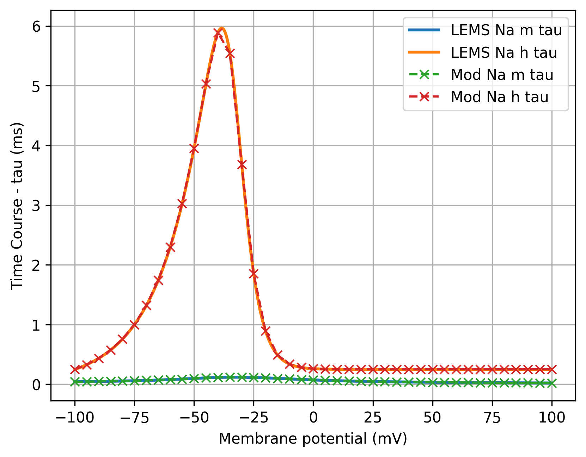
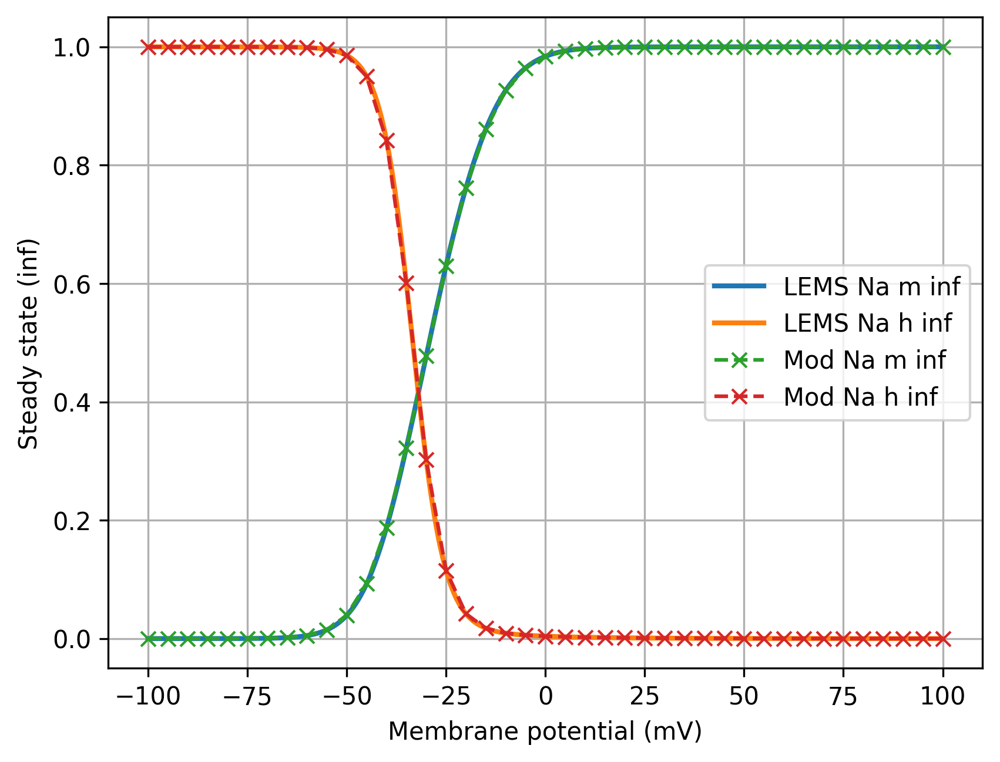
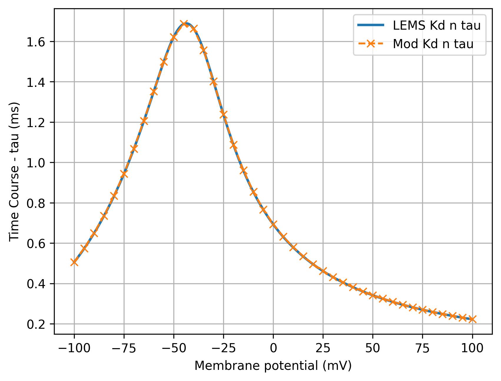
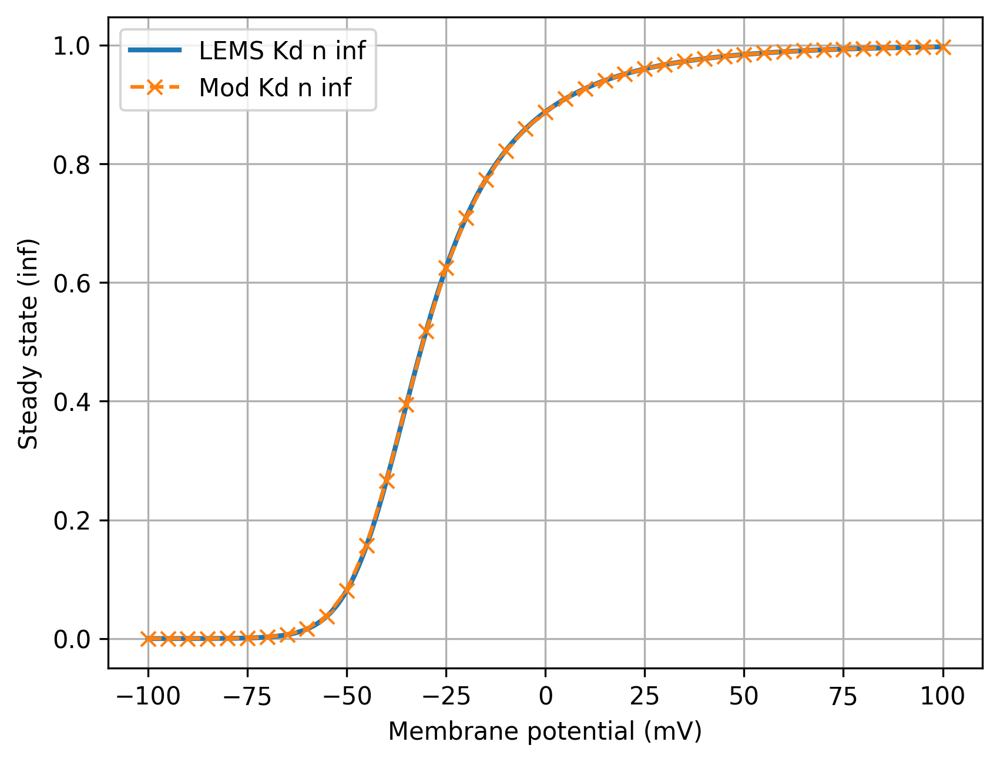
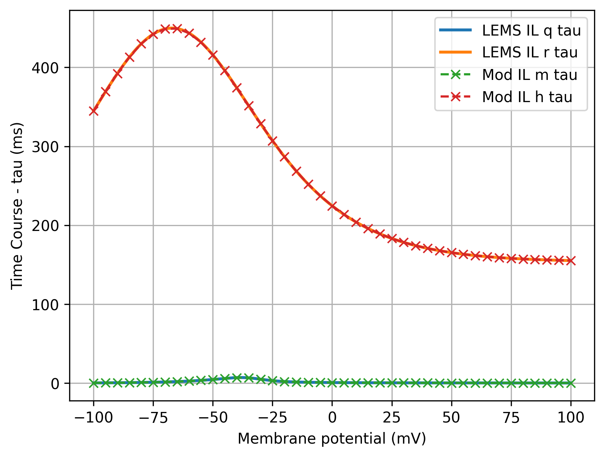
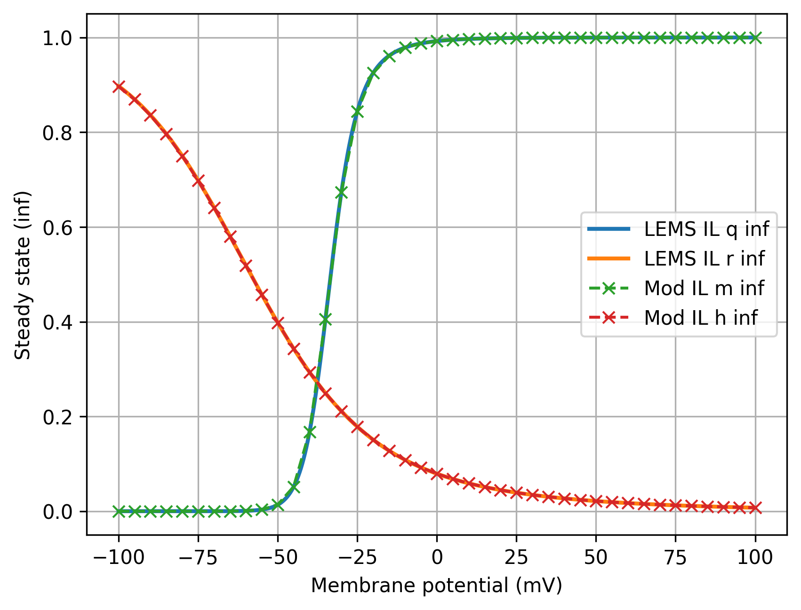
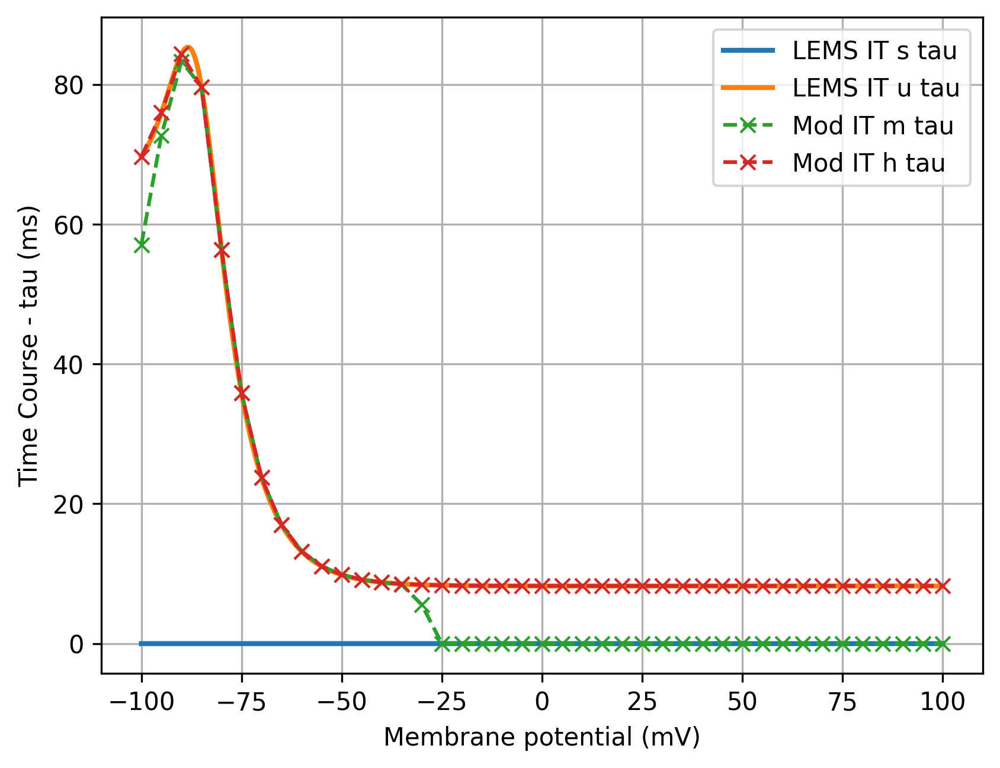
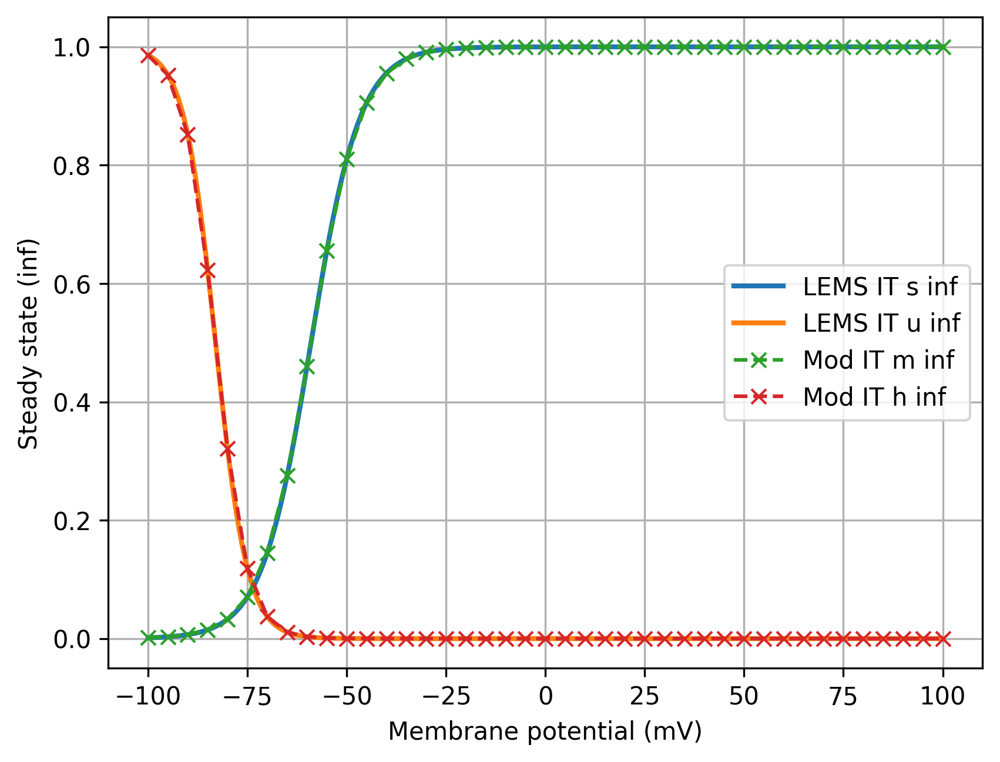
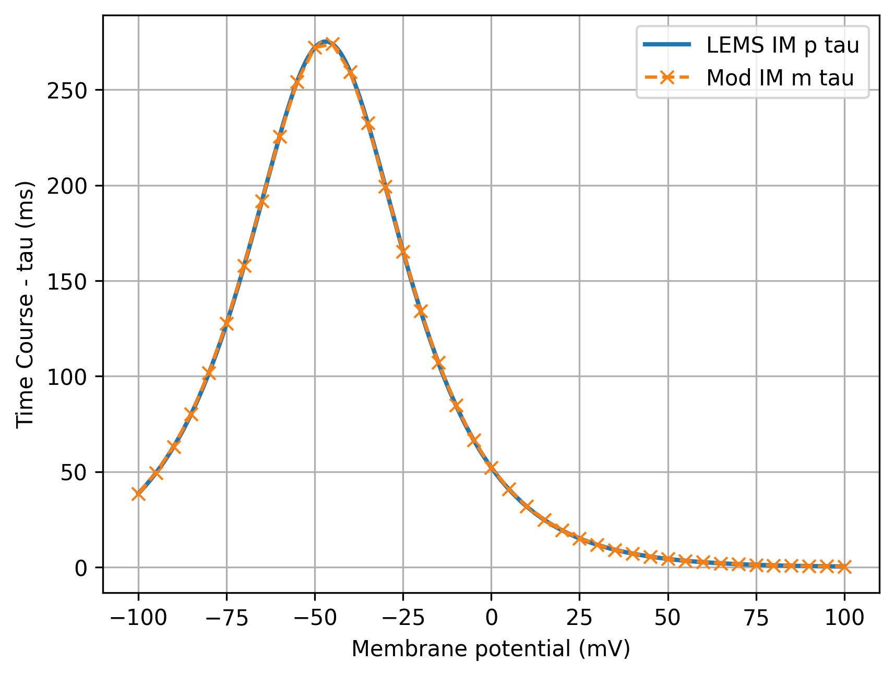
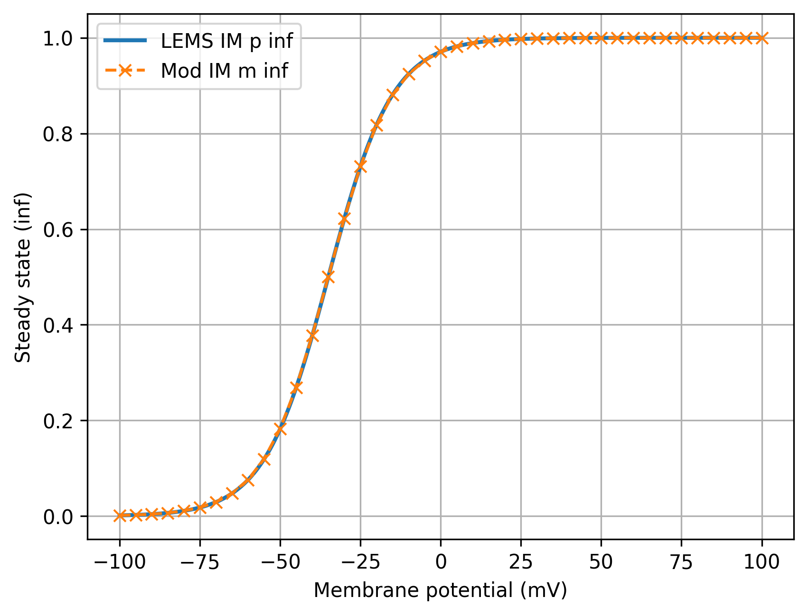

These are scripts which have been slightly modified from the original NEURON code in [NEURON_ORIG](../NEURON_ORIG)

This is mainly to ensure the code in NEURON_ORIG remains unchanged. The NeuroML version of this model will be matched against the code **here**. 

The list of differences between these files and the original code can be found [here](diffs_to_original.txt).   

  
  
  
  
  