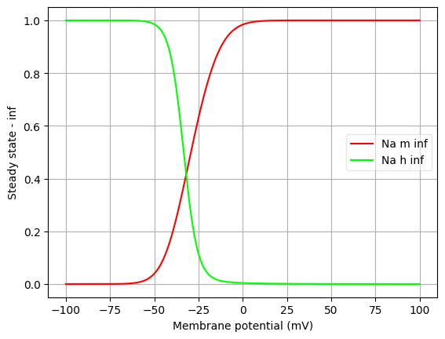
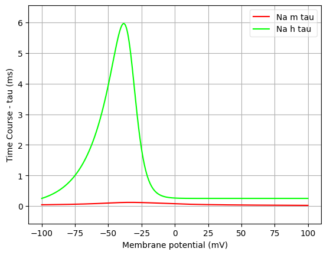
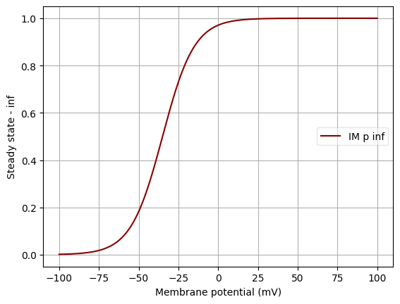
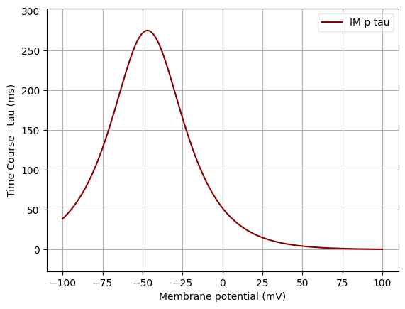
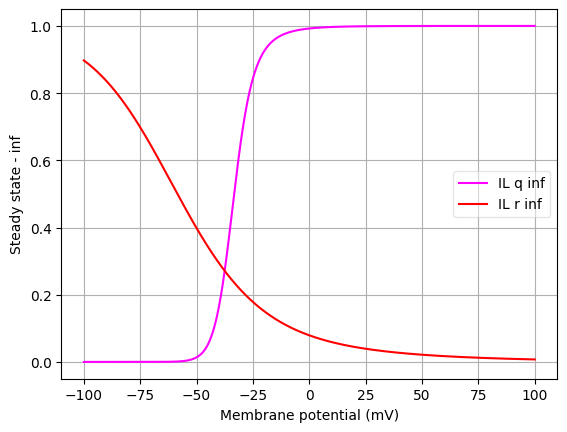
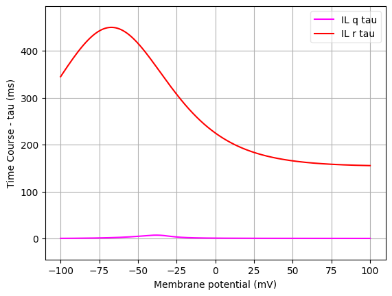

Channel information
===================

Channel information at: T = 36.0 degC, E_rev = 0 mV, [Ca2+] = 0.00043 mM

<h2>Na</h2>

Ion: <b>na</b> |
Conductance expression: <b>g = gmax * m3 * h </b> |
NeuroML2 file: <a href="../Na/Na.channel.nml">Na/Na.channel.nml</a>

Notes
Na+ current based on Traub and Miles 1991.
            
Comment from original mod file: 
Hippocampal HH channels
Fast Na+ and K+ currents responsible for action potentials
Iterative equations

Equations modified by Traub, for Hippocampal Pyramidal cells, in: Traub and Miles, Neuronal Networks of the Hippocampus, Cambridge, 1991

- range variable vtraub adjust threshold
- Written by Alain Destexhe, Salk Institute, Aug 1992
- Modified Oct 96 for compatibility with Windows: trap low values of arguments

<h2>IM</h2>

Ion: <b>k</b> |
Conductance expression: <b>g = gmax * p </b> |
NeuroML2 file: <a href="../IM/IM.channel.nml">IM/IM.channel.nml</a>

Notes
Slow M-type K+ current for spike frequency adaptation
            
Comment from original mod file:
M-current, responsible for the adaptation of firing rate and the afterhyperpolarization (AHP) of cortical pyramidal cells
First-order model described by hodgkin-Hyxley like equations.
K+ current, activated by depolarization, noninactivating.

Model taken from Yamada, W.M., Koch, C. and Adams, P.R.  Multiple channels and calcium dynamics.  In: Methods in Neuronal Modeling, 
edited by C. Koch and I. Segev, MIT press, 1989, p 97-134.
    
See also: McCormick, D.A., Wang, Z. and Huguenard, J. Neurotransmitter control of neocortical neuronal activity and excitability. 
Cerebral Cortex 3: 387-398, 1993.

Written by Alain Destexhe, Laval University, 1995
        

<h2>Kd</h2>

Ion: <b>k</b> |
Conductance expression: <b>g = gmax * n4 </b> |
NeuroML2 file: <a href="../Kd/Kd.channel.nml">Kd/Kd.channel.nml</a>

Notes
Delayed rectifier K+ current based on Traub and Miles 1991.
            
Comment from original mod file: Hippocampal HH channels
Fast Na+ and K+ currents responsible for action potentials
Iterative equations

Equations modified by Traub, for Hippocampal Pyramidal cells, in: Traub and Miles, Neuronal Networks of the Hippocampus, Cambridge, 1991

- range variable vtraub adjust threshold
- Written by Alain Destexhe, Salk Institute, Aug 1992
- Modified Oct 96 for compatibility with Windows: trap low values of arguments

<h2>IT</h2>

Ion: <b>ca</b> |
Conductance expression: <b>g = gmax * s2 * u </b> |
NeuroML2 file: <a href="../IT/IT.channel.nml">IT/IT.channel.nml</a>

Notes
Low threshold calcium current
            
Comment from original mod file:
Ca++ current responsible for low threshold spikes (LTS)
THALAMOCORTICAL CELLS
Differential equations

Model based on the data of Huguenard and McCormick, J Neurophysiol
68: 1373-1383, 1992 and Huguenard and Prince, J Neurosci.
12: 3804-3817, 1992.

Features:

	- kinetics described by Nernst equations using a m2h format
	- activation considered at steady-state
	- inactivation fit to Huguenard's data using a bi-exp function
	- shift for screening charge, q10 of inactivation of 3

Written by Alain Destexhe, Salk Institute, 1993; modified 1995

<h2>IL</h2>

Ion: <b>ca</b> |
Conductance expression: <b>g = gmax * q2 * r </b> |
NeuroML2 file: <a href="../IL/IL.channel.nml">IL/IL.channel.nml</a>

Notes
High threshold calcium current
            
Comment from original mod file:

   - Ca++ current, L type channels
   - Differential equations

   - Model from:

   Reuveni I; Friedman A; Amitai Y; Gutnick MJ.
     Stepwise repolarization from Ca2+ plateaus in neocortical pyramidal cells:
     evidence for nonhomogeneous distribution of HVA Ca2+ channels in
     dendrites.
   Journal of Neuroscience, 1993 Nov, 13(11):4609-21.

   - Experimental data for voltage-dependent activation:

   Sayer RJ; Schwindt PC; Crill WE.
     High- and low-threshold calcium currents in neurons acutely isolated from
     rat sensorimotor cortex.
   Neuroscience Letters, 1990 Dec 11, 120(2):175-8.
 
   - Experimental data for voltage-dependent inactivation:

   Dichter MA; Zona C.
     Calcium currents in cultured rat cortical neurons.
   Brain Research, 1989 Jul 17, 492(1-2):219-29.

   - Calcium-dependent inactivation was not modeled; if interested, see:

   Kay AR.
     Inactivation kinetics of calcium current of acutely dissociated CA1
     pyramidal cells of the mature guinea-pig hippocampus.
   Journal of Physiology, 1991 Jun, 437:27-48.

   - m2h kinetics from:

   Kay AR; Wong RK.
     Calcium current activation kinetics in isolated pyramidal neurones of the
     Ca1 region of the mature guinea-pig hippocampus.
   Journal of Physiology, 1987 Nov, 392:603-16.

   - Reversal potential described by Nernst equation
   - no temperature dependence included (rates correspond to 36 degC)

   Alain Destexhe, Laval University, 1996

