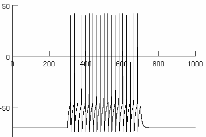
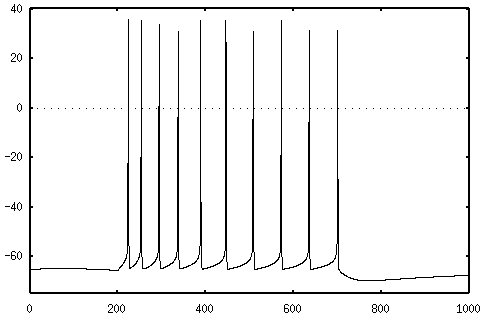
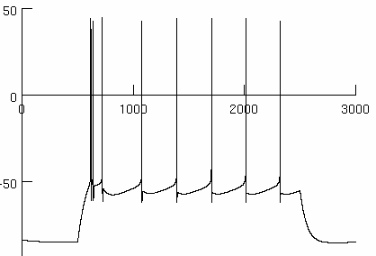
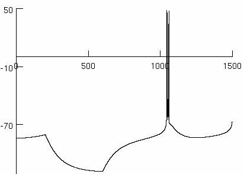

## Minimal Hodgkin–Huxley type models for four common classes of cortical and thalamic neurons

#### Overview of the Model

[Pospischil, et. al. (2008)](http://link.springer.com/article/10.1007/s00422-008-0263-8) describes conductance-based ([Hodgin-Huxley](https://en.wikipedia.org/wiki/Hodgkin%E2%80%93Huxley_model)) models of four different classes of [cortical](https://en.wikipedia.org/wiki/Cerebral_cortex) and [thalamic](https://en.wikipedia.org/wiki/Thalamus) neurons. The classes represented are:

- Regular Spiking (RS) cells
- Fast Spiking (FS) cells
- Intrinsicly Bursting (IB)
- Low-Threshold Spike (LTS) cells

All cell models are composed of [ion channel](https://en.wikipedia.org/wiki/Ion_channel) models generating the following currents:

- INa Voltage dependent Na+ current for depolarization phase of action potentials (APs)
- IKd Delayed rectifier K+ current for hyperpolarization phase of APs
- IM Slow non-inactivating K+ current for spike-frequency adaptation
- IL High-threshold Ca2+ current for burst generation
- IT Low-threshold Ca2+ current for rebound-burst generation

Leak and input current models are present in all cells as well.

These models demonstrate that a wide variety of spiking behaviors can be implemented using a small number of ion channels. 

**Original Reference:**

[Minimal Hodgkin–Huxley type models for different classes of cortical and thalamic neurons](http://link.springer.com/article/10.1007/s00422-008-0263-8), Martin Pospischil, Maria Toledo-Rodriguez, Cyril Monier, Zuzanna Piwkowska, Thierry Bal, Yves Frégnac, Henry Markram and Alain Destexhe, *Biological Cybernetics*, 2008.

#### Demonstrated Physiological Properties

Specifically, these models demonstrate the following properties:

**Regular Spiking**
The use of INa and IKd currents and applying a constant input current is sufficient to generate a train of spikes with constant frequency. 

**Frequency Adaptation**
In addition to INa and IKd currents, including the IM current will result in a train of spikes where the inter-spike interval increases (and frequency decreases) with each spike in the train.

**Intrinsic Bursting**

When a calcium-dependent IL current is added to a cell with INa, IKd, and IM currents, the cell membrane potential will display an initial high-frequency burst of spikes and then settle onto a regular, frequency-adapting spiking behavior. The IL current makes use of variable Ca2+ reversal potential which is computed from the [Nernst equation](https://en.wikipedia.org/wiki/Nernst_equation) by tracking changes in the intracellular Ca2+ concentration.

**Rebound Bursting**

Similarly, using the calcium-dependent IT current instead of IL results in a cell that will fire a series of high-frequency spikes after a negative (hyperpolarizing) current is withdrawn from cell. 

Figure produced with NEURON_ORIG LTS Cell with gcabar_it = 0.0012 and input current -0.1 amp 

### Model Versions

#### Why Convert to NeuroML?

The original models were implemented for the [NEURON simulator](https://www.neuron.yale.edu/neuron/). We have converted the model to NeuroML. The modular, XML nature of NeuroML allows to quickly re-use this model in network simulations and our tools allow [automated conversion to other supported simulator formats](https://neuroml.org/mappings).

#### NeuroML Version

All five cells have been implemented in NeuroML and match the output produced by the cells provided in the [original NEURON code](http://senselab.med.yale.edu/ModelDB/ShowModel.cshtml?model=123623).

#### XPP Version

The Regular Spiking (RS) cell was also implemented in [XPP simulator](http://www.math.pitt.edu/~bard/xpp/xpp.html) to enable rapid debugging of parameter and other issues with the original models.

### Installation Instructions

1. [Download the Model Files](archive/master.zip), or clone the repository using git: `git clone https://github.com/OpenSourceBrain/PospischilEtAl2008.git`
2. [Follow instructions to Install jNeuroML](https://github.com/NeuroML/jNeuroML) for the **jnml** executable. On Windows, you may also need [SVN](https://subversion.apache.org/packages.html#windows). Alternatively install [PyNeuroML](https://github.com/NeuroML/pyNeuroML) for the **pynml** executable. 
3. Set the $PATH and $JNML_HOME variables as described in [#2](https://github.com/NeuroML/jNeuroML)
4. Extract the model files to a folder.
5. For Figure 1: Change to NeuroML2/Figure1 folder. Type `jnml LEMS_Figure1C.xml` or `pynml LEMS_Figure1C.xml`.
6. For RS (and other cells): Change to NeuroML2/cells/RS (or other) folder. Type `jnml LEMS_RS.xml` or `pynml LEMS_RS.xml`. 
7. Windows with the plotted figures should show up as can be seen below.

### Issues

See [Issues Tab](issues) for reported issues with the original model and the conversion. 

